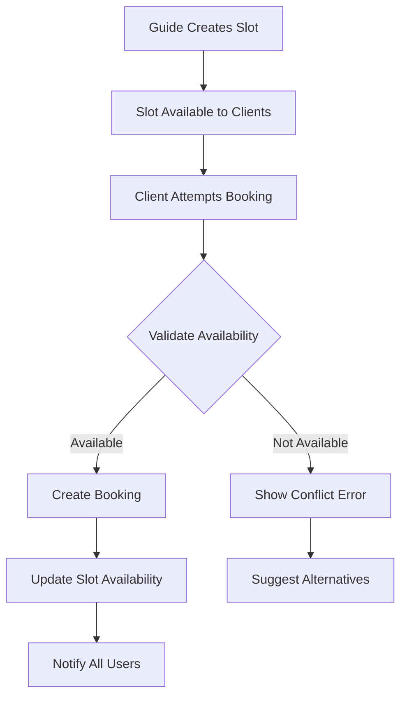

# 🎯 Booking and Availability System Documentation

## Overview

This document describes the comprehensive booking and availability system implemented for the Myowntour platform. The system ensures real-time synchronization, prevents overbooking, and provides clear error handling for booking conflicts.

## 🏗️ System Architecture

### Core Components

1. **AvailabilityManager** - Guide interface for managing availability slots
2. **AvailabilityCalendar** - Client/Tour Operator interface for viewing available slots
3. **EnhancedBookingModal** - Advanced booking interface with real-time validation
4. **BookingConflictHandler** - Real-time conflict detection and resolution
5. **BookingService** - Core booking logic and validation
6. **AvailabilitySyncService** - Real-time synchronization and conflict management

### Database Schema

The system uses the existing `availability_slots` and `bookings` tables with the following key relationships:

```sql
-- Availability Slots
availability_slots (
  id UUID PRIMARY KEY,
  excursion_id UUID REFERENCES excursions(id),
  date DATE NOT NULL,
  start_time TIME NOT NULL,
  end_time TIME,
  max_participants INTEGER NOT NULL,
  available_spots INTEGER NOT NULL,
  is_available BOOLEAN DEFAULT true,
  price_override DECIMAL(10,2),
  created_at TIMESTAMP DEFAULT NOW()
)

-- Bookings
bookings (
  id UUID PRIMARY KEY,
  client_id UUID REFERENCES profiles(id),
  excursion_id UUID REFERENCES excursions(id),
  slot_id UUID REFERENCES availability_slots(id),
  participants_count INTEGER NOT NULL,
  total_amount DECIMAL(10,2) NOT NULL,
  status TEXT CHECK (status IN ('pending', 'confirmed', 'cancelled', 'completed')),
  special_requests TEXT,
  booking_date DATE NOT NULL,
  created_at TIMESTAMP DEFAULT NOW()
)
```

## 🔄 Real-time Synchronization

### How It Works

1. **Guide Sets Availability**: Guides create availability slots with specific dates, times, and participant limits
2. **Real-time Updates**: When bookings are made, availability is updated in real-time across all users
3. **Conflict Prevention**: The system prevents overbooking by validating availability before confirming bookings
4. **Live Notifications**: Users receive immediate feedback about availability changes

### Synchronization Flow



## 🎯 Key Features

### 1. Availability Rules

- **Guide Control**: Each guide can define which days and times they are available
- **Participant Limits**: Maximum number of participants per excursion slot
- **Automatic Closure**: Slots automatically close when maximum capacity is reached
- **Date Restrictions**: Guides can mark specific days as unavailable

### 2. Real-time Validation

- **Pre-booking Checks**: System validates availability before allowing bookings
- **Conflict Detection**: Real-time detection of booking conflicts
- **Overbooking Prevention**: Automatic prevention of overbooking scenarios
- **Live Updates**: All users see availability changes immediately

### 3. Error Handling

- **Clear Error Messages**: Specific error messages for different conflict types
- **Conflict Resolution**: Suggested actions to resolve booking conflicts
- **Alternative Suggestions**: System suggests alternative slots when conflicts occur
- **Retry Mechanisms**: Easy retry options for failed bookings

## 📱 User Interfaces

### Guide Dashboard - Availability Management

**Location**: `src/components/dashboard/AvailabilityManager.tsx`

**Features**:
- Create new availability slots
- Edit existing slots (date, time, participants, price)
- Toggle slot availability on/off
- Delete slots (with booking validation)
- Real-time availability calculation
- Visual status indicators

**Usage**:
```tsx
<AvailabilityManager
  excursion={excursion}
  onAvailabilityUpdate={() => {
    // Refresh dashboard data
    loadDashboardData();
  }}
/>
```

### Client Dashboard - Booking Interface

**Location**: `src/components/booking/EnhancedBookingModal.tsx`

**Features**:
- Step-by-step booking process
- Real-time availability calendar
- Conflict detection and resolution
- Payment integration
- Booking confirmation

**Usage**:
```tsx
<EnhancedBookingModal
  isOpen={showBookingModal}
  onClose={() => setShowBookingModal(false)}
  excursion={selectedExcursion}
  onBookingSuccess={(booking) => {
    // Handle successful booking
    setShowBookingModal(false);
    addNotification('Réservation créée avec succès !', 'success');
  }}
/>
```

### Availability Calendar

**Location**: `src/components/booking/AvailabilityCalendar.tsx`

**Features**:
- Visual calendar interface
- Real-time availability display
- Date filtering
- Slot selection
- Availability status indicators

## 🔧 API Services

### BookingService

**Location**: `src/services/bookingService.ts`

**Key Methods**:

```typescript
// Validate booking request
validateBooking(request: BookingRequest): Promise<BookingValidationResult>

// Create new booking
createBooking(request: BookingRequest): Promise<{success: boolean; booking?: Booking; error?: string}>

// Get available slots
getAvailableSlots(excursionId: string, date?: string): Promise<AvailabilityCheck[]>

// Update availability in real-time
updateAvailabilityRealTime(slotId: string): Promise<void>
```

### AvailabilitySyncService

**Location**: `src/services/availabilitySyncService.ts`

**Key Methods**:

```typescript
// Subscribe to availability updates
subscribeToAvailabilityUpdates(excursionId: string, callback: (update: AvailabilityUpdate) => void): () => void

// Subscribe to booking conflicts
subscribeToBookingConflicts(excursionId: string, callback: (conflict: BookingConflict) => void): () => void

// Validate booking in real-time
validateBookingRealTime(excursionId: string, slotId: string, participantsCount: number): Promise<{isValid: boolean; conflict?: BookingConflict}>

// Refresh slot availability
refreshSlotAvailability(slotId: string): Promise<void>
```

## 🚨 Conflict Types and Resolution

### 1. Insufficient Spots

**Scenario**: Client requests more participants than available spots

**Resolution**:
- Show exact number of available spots
- Suggest reducing participant count
- Offer alternative slots
- Provide retry option

### 2. Slot Unavailable

**Scenario**: Slot has been marked as unavailable by guide

**Resolution**:
- Explain slot is no longer available
- Suggest alternative dates/times
- Offer to refresh availability
- Provide contact information for guide

### 3. Guide Unavailable

**Scenario**: Guide has marked themselves as unavailable

**Resolution**:
- Explain guide is not available
- Suggest alternative guides
- Offer different dates
- Provide contact options

## 🔄 Real-time Updates

### Supabase Realtime Integration

The system uses Supabase Realtime to provide live updates:

```typescript
// Subscribe to availability slot changes
const channel = realtimeService.subscribeToAvailabilitySlots(excursionId, (payload) => {
  if (payload.eventType === 'UPDATE' || payload.eventType === 'INSERT') {
    // Update UI with new availability
    updateAvailabilityDisplay(payload.new);
  }
});
```

### Update Triggers

Availability updates are triggered by:
- New bookings being created
- Bookings being confirmed
- Bookings being cancelled
- Guide manually updating slot availability
- Guide deleting slots

## 📊 Example Use Cases

### Case 1: Normal Booking Flow

1. **Guide Setup**: Guide creates availability slot for Sunday, August 31st with 10 places
2. **Client Booking**: Tour Operator books 5 places
3. **System Update**: Availability automatically updates to 5 places remaining
4. **Real-time Sync**: All users see updated availability immediately

### Case 2: Overbooking Prevention

1. **Client Attempt**: Client tries to book 8 places when only 5 are available
2. **System Validation**: Booking validation fails
3. **Error Display**: Clear error message shows "Only 5 places available"
4. **Resolution Options**: System suggests reducing participants or choosing different slot

### Case 3: Guide Unavailability

1. **Guide Action**: Guide marks Monday as unavailable
2. **System Update**: All Monday slots become unavailable
3. **Client Impact**: Clients see Monday slots as "Unavailable"
4. **Alternative Suggestions**: System suggests Tuesday or other available days

## 🛠️ Implementation Details

### Database Triggers

The system uses database triggers to automatically update availability:

```sql
-- Function to update availability when bookings change
CREATE OR REPLACE FUNCTION update_availability_on_booking_change()
RETURNS TRIGGER AS $$
BEGIN
  -- Recalculate available spots
  UPDATE availability_slots 
  SET available_spots = max_participants - (
    SELECT COALESCE(SUM(participants_count), 0)
    FROM bookings 
    WHERE slot_id = NEW.slot_id AND status = 'confirmed'
  )
  WHERE id = NEW.slot_id;
  
  RETURN NEW;
END;
$$ LANGUAGE plpgsql;
```

### Error Handling

Comprehensive error handling ensures users always receive clear feedback:

```typescript
try {
  const result = await bookingService.createBooking(bookingRequest);
  if (result.success) {
    // Handle success
  } else {
    // Handle specific error
    setError(result.error);
  }
} catch (error) {
  // Handle unexpected errors
  setError('Une erreur inattendue s\'est produite');
}
```

## 🧪 Testing

### Test Scenarios

1. **Normal Booking**: Test successful booking creation
2. **Overbooking**: Test prevention of overbooking
3. **Real-time Updates**: Test live availability updates
4. **Conflict Resolution**: Test conflict detection and resolution
5. **Guide Actions**: Test guide availability management

### Test Data

Use the provided test cards for payment testing:
- **Visa Test**: `4242424242424242`
- **Mastercard Test**: `5555555555554444`
- **Declined Card**: `4000000000000002`

## 🚀 Deployment

### Environment Variables

Ensure these environment variables are set:
```
VITE_SUPABASE_URL=your-supabase-url
VITE_SUPABASE_ANON_KEY=your-supabase-anon-key
```

### Database Setup

Run the database schema from `COMPLETE_DATABASE_SCHEMA.sql` to ensure all tables and triggers are properly set up.

## 📈 Performance Considerations

### Optimization Strategies

1. **Indexing**: Proper database indexes on frequently queried fields
2. **Caching**: Client-side caching of availability data
3. **Debouncing**: Debounced real-time updates to prevent excessive API calls
4. **Pagination**: Paginated loading of availability slots for large datasets

### Monitoring

Monitor these key metrics:
- Booking success rate
- Conflict resolution time
- Real-time update latency
- User satisfaction with booking flow

## 🔮 Future Enhancements

### Planned Features

1. **Advanced Scheduling**: Recurring availability patterns
2. **Waitlist System**: Automatic waitlist for fully booked slots
3. **Smart Suggestions**: AI-powered alternative slot suggestions
4. **Mobile Notifications**: Push notifications for availability changes
5. **Analytics Dashboard**: Detailed booking and availability analytics

### Integration Opportunities

1. **Calendar Integration**: Google Calendar, Outlook integration
2. **Payment Gateways**: Stripe, PayPal integration
3. **Communication**: In-app messaging between guides and clients
4. **Reviews**: Integrated review system for completed bookings

## 📞 Support

### Troubleshooting

**Common Issues**:
1. **"Supabase not configured"** → Check environment variables
2. **"Table doesn't exist"** → Run database schema setup
3. **"RLS policy violation"** → Check user permissions
4. **"Real-time not working"** → Verify Supabase Realtime is enabled

### Getting Help

1. Check browser console for errors
2. Verify Supabase dashboard for backend issues
3. Test with provided test data
4. Review this documentation for implementation details

---

**🎉 The booking and availability system is now fully implemented and ready for production use!**

*This system ensures a smooth, real-time booking experience while preventing conflicts and providing clear feedback to all users.*
